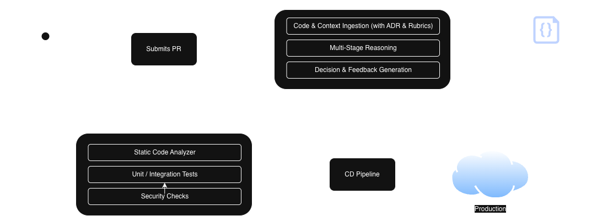

# A New Layer in the Software Development Life Cycle (SDLC): "LLM-as-a-Judge" for Autonomous Quality Assurance

In 2025, the software world largely solved the "productivity" problem thanks to AI agents capable of generating massive amounts of code in seconds. However, 2026 brought a new crisis: The Quality Wall. Given the massive volume of code produced by AI, manual review of this code (Code Review) by humans has become physically impossible.

At this point, the LLM-as-a-Judge architecture comes into play, positioning itself as a critical middle layer within the SDLC (Software Development Life Cycle), automating supervision as well.

## 1. Architectural Positioning: "Cognitive Quality Gate"

While traditional Quality Gates typically rely on static analysis, the Cognitive Quality Gate is a new generation control mechanism that inspects not only the syntactic correctness of the code but also its architectural alignment and business logic by "reasoning".

LLM-as-a-Judge is not a simple "prompt"; it is a multi-stage cognitive control mechanism strategically placed in the software delivery process. This layer takes raw code generated by developers or AI and passes it through an architectural filter to transform it into a final decision. This layer is a multi-stage cognitive control mechanism strategically placed in the software delivery process.

The process consists of three main technical stages; code & context ingestion, multi-stage reasoning, and decision & feedback generation. Let's examine these stages in order.

### Code & Context Ingestion

This stage ensures the "Judge" masters not just the code lines in front of it, but the entire ecosystem where that code lives.

*   **ADR & Standard Integration:** The Judge loads the company's Architectural Decision Records (ADR) files and coding standards into the system. This way, the judge can inspect not only the syntactic correctness of the code but also its architectural alignment and business logic by "reasoning".
*   **Knowledge Graph Creation:** Analyzes not just the changed file, but other classes, database schemas, and dependencies affected by that file as a "context graph". This way, the judge can inspect not only the syntactic correctness of the code but also its architectural alignment and business logic by "reasoning".
*   **Rubric Injection:** Evaluation matrices (Rubrics) defined beforehand give instructions to the model on which "lens" to look through at this stage. This way, the judge can inspect not only the syntactic correctness of the code but also its architectural alignment and business logic by "reasoning".

### Multi-Stage Reasoning

Instead of deciding on code correctness in a single pass, a "debate" process between models is operated.

*   **Criticism and Defense:** While the first model (Critic) lists errors, a second model tests these findings: "Is this really an error or a conscious choice made for performance?" This way, the judge can inspect not only the syntactic correctness of the code but also its architectural alignment and business logic by "reasoning".
*   **Chain-of-Thought (CoT):** The Judge model watches this debate and writes down the logical steps of the decision. This way, the judge can inspect not only the syntactic correctness of the code but also its architectural alignment and business logic by "reasoning".

### Decision & Feedback Generation

Transforms the analysis into a structured report understandable by a developer or an AI agent.

*   **Structured Output:** The decision is produced in JSON format for machine readability. This way, the judge can inspect not only the syntactic correctness of the code but also its architectural alignment and business logic by "reasoning".
*   **Narrative Feedback:** It doesn't just say "incorrect" to the developer; it mentors by saying "This approach leads to N+1 problem, you should use this Query structure instead". This way, the judge can inspect not only the syntactic correctness of the code but also its architectural alignment and business logic by "reasoning".

## 2. Paradigm Shift: Traditional CI/CD vs. LLM-as-a-Judge

The modern development pipeline of 2026 combines both traditional and LLM-based controls; but roles are sharp. Traditional CI/CD tools (Linter, Unit Test) control the syntactic correctness and test coverage of the code, while the LLM-as-a-Judge architecture inspects the architectural alignment and business logic of the code by "reasoning".

The table below compares traditional CI/CD and LLM-as-a-Judge architectures.

| Comparison Area | Traditional CI/CD (Linter, Unit Test) | LLM-as-a-Judge (Cognitive Supervision) |
| :--- | :--- | :--- |
| **Analysis Method** | Deterministic and Rule Based | Intuitive and Contextual |
| **Error Catching** | Syntax errors, test coverage, known CVEs | Architectural leaks, logical security vulnerabilities (IDOR), design flaws |
| **Feedback** | Static report ("Line 42: Unused variable") | Narrative and Educational report ("This approach has O(n^2) risk") |
| **Code Readability** | Standard naming conventions (CamelCase etc.) | Domain language (Ubiquitous Language) alignment analysis |
| **Scope** | Only current file or diff | Entire repository, ADR documents and technical debts |

## 3. Reasoning Traceability

The biggest difference distinguishing the LLM-as-a-Judge architecture from traditional tests is its ability to present the "cause-effect" relationship behind the decision. When the Judge model rejects a code block, it presents this not just as a rule violation but as an architectural argument. This way, the developer not only fixes the error but gains awareness about the system's future.

For example; it presents feedback like "Although this change is technically correct, it triggers an N+1 query problem in the database layer and contradicts our current scaling vision". This allows the developer not only to fix the error but to gain awareness of the future of the system.

## 4. Use Case: Contextual Security and Architectural Alignment

In this section, let's examine how the LLM-as-a-Judge architecture is used in the real world.

Imagine a developer adding a "Retry Mechanism" to the payment system.

*   **Traditional CI/CD:** Confirms the code compiles and unit tests pass. However, it cannot inspect the architectural alignment and business logic of the code by "reasoning".
*   **LLM-as-a-Judge:** Knowing the project's financial and architectural standards, it realizes: "Code retries but doesn't send idempotency key information to prevent duplicate charges during network timeouts. This violates our financial consistency standard".
*   **Result:** PR is automatically rejected on architectural grounds, not technical ones. The developer not only fixes the error but gains awareness about the system's future.

In this example, we can clearly see the difference between the LLM-as-a-Judge architecture and traditional CI/CD tools.

## 5. Evaluation Layer: Architectural Rubric Design

The rubrics we use to train the judge are now living documents.

So what is a rubric and how is it designed? A rubric is a set of criteria the judge uses to evaluate code quality. These criteria reflect the project's architectural standards and business rules. The most important point to consider when designing rubrics is that the criteria should be clear and understandable. Also, different scoring levels should be determined for each criterion. This way, the judge can evaluate code quality more accurately. An example rubric prepared for a payment system is shown below.

| Criterion | 1 Point (Reject) | 3 Points (Needs Improvement) | 5 Points (Approve) |
| :--- | :--- | :--- | :--- |
| **Resilience** | Timeout not defined | Retry mechanism exists but backoff missing | Circuit Breaker and Bulkhead fully applied |
| **Cognitive Load** | Logical flow not linear | Modular but abstraction inconsistent | Full compliance with clean code principles |
| **Domain Integrity** | Domain models intertwined with DB schema | Domain language exists but business rules leaked | Full compliance with DDD and Ubiquitous Language |
| **Architectural Boundaries** | Cross-cell DB/API access exists | Access exists but done via async/proxy | Full compliance with Cellular Architecture boundaries |

This scoring system allows the judge to evaluate code quality more accurately.

## 6. Hybrid Supervision: Human-in-the-loop (HITL) Integration

An autonomous judge layer does not remove the human from the process; it elevates the human role to "judge of judges". The HITL layer activates when the Judge LLM's confidence score is low. The developer here is positioned not as a "code writer", but as an "architectural authority" supervising the decision made by AI.

Ultimately, if we want to completely remove the human factor, what should we do to increase the Judge LLM's confidence score? Or should we increase it? The answer to this question is a completely controversial topic and a question that every organization needs to answer according to its own needs in my opinion.

## 7. Implementation Guide: Roadmap for Developers

*   **Hybrid Structure:** Let Linters eliminate simple errors, while LLM Judge focuses on architecture.
*   **Rubric Engineering:** The organization's technical vision must be engraved into these tables.
*   **Golden Files:** Introduce "perfect" code examples from your project as references to the Judge.
*   **Audit Log:** Regularly review the Judge's decisions with senior developers.

## Final Word: New Generation Development – "Orchestration"

In 2026, development signals not an end, but a much more strategic beginning. As AI writes the code, we are becoming designers who breathe philosophy, aesthetics, and architectural soul into this code.

We no longer spend our time fixing syntax errors, but "designing systems that automate quality". AI doesn't write code for us; AI scales our expertise standards. We are now strategic architects who decide where technology will go, transform quality into a digital constitution (rubric), and conduct this massive orchestra.

[Evren Tan][evren-tan-homepage] - Software Crafter

[evren-tan-homepage]: https://evrentan.com
